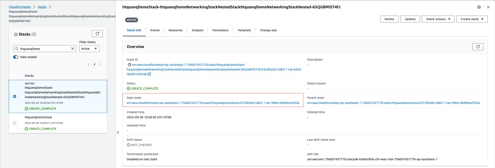
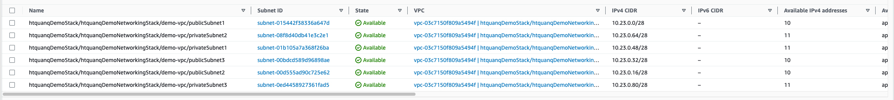
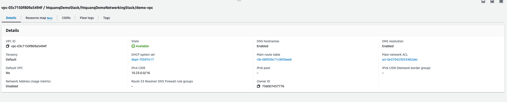
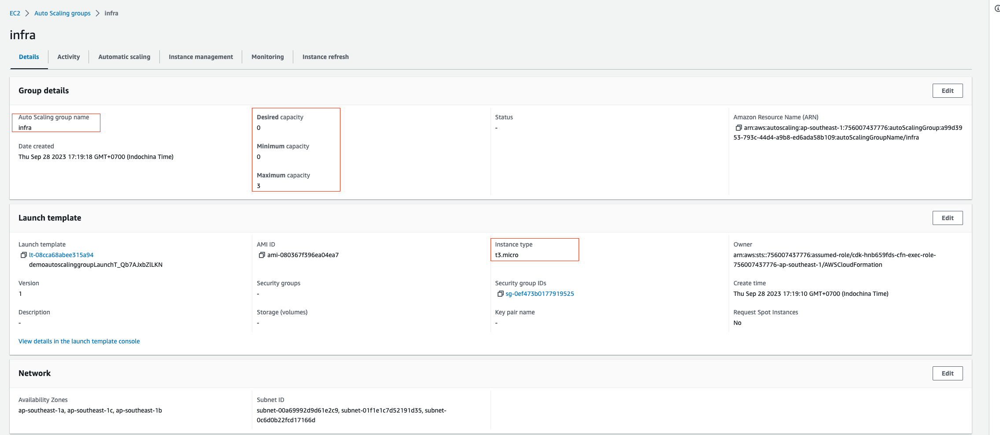

# Sample code to create VPC

## Input

```yaml
# config/demo.yaml
"vpcId": "vpc-0ece9a0b3eda519e9"
"accountId": "756007437776"
"region": "ap-southeast-1"
"awsProfile": "default"

vpc:
  name: "demo"
  cidr: 10.23.0.0/16
  cidrMask: 28

scalingGroup: 
  - name: infra
    maxSize: 3
    minSize: 0
    desiredSize: 0
    outbound: true
    associatePublicIP: true
    instanceType: t3
    instanceSize: micro
    image: "ubuntu"
    subnetType: "public"
```

## Ouput

This CDK will create a main stack and nested stacks (NetworkingStack, AutoScalingGroup)

Why I don't put everything into a single stack:
* Hard to maintain code base since it can be very long
* Made changes to single code base can affect resources that I don't want to modify (by mistake)

The reason I developed it in Go instead of Typescript while I still can do it is I work with Kubernetes and Helm so Go is more familiar to me and I want to unite the language I use





## Useful commands

 * `cdk deploy --context environment=demo`      deploy this stack to your default AWS account/region
 * `cdk diff --context environment=demo`        compare deployed stack with current state
 * `cdk synth --context environment=demo`       emits the synthesized CloudFormation template

## Notes
You can view my aws-cdk-app with Typescript in [here](https://github.com/htquanq/sample-aws-cdk)